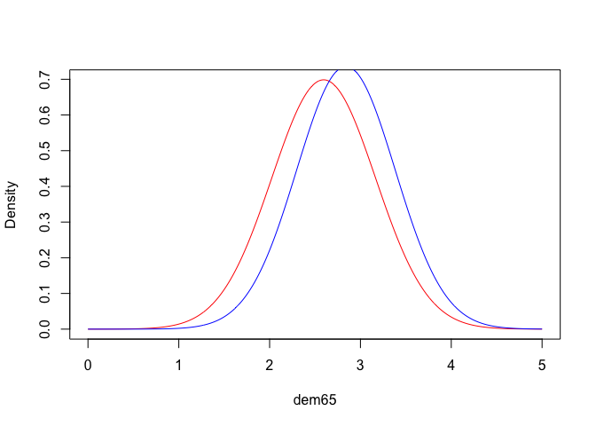

<!-- README.md is generated from README.Rmd. Please edit that file -->

# inferSEM

<!-- badges: start -->

[](https://lifecycle.r-lib.org/articles/stages.html#experimental)
[](https://github.com/jhorzek/inferSEM/actions/workflows/R-CMD-check.yaml)
<!-- badges: end -->

inferSEM is an experimental R package for inference on structural
equation models fitted with OpenMx.

inferSEM currently only has one user facing function: `infer`. This
function allows computing the interventional and conditional
distributions of SEMs based on Gische et al. (2022). However, it is not
really tested yet and the implementation could be wrong. This is just a
small experiment package. For a thorough introduction to interventional
and conditional distributions in SEM, please see Gische et al. (2021)
and Gische et al. (2022).

The interventional distribution is computed as follows: Say we intervene
by setting the value of the variable x2 to 1. In that case:

1.  The RAM matrices are extracted from the SEM
2.  The SEM is “mutilated” - a term used in Bayesian networks (see
    Scutari, 2010) to describe the removal of any effects on the
    intervention variable (x2 in our case). In SEM this also includes
    the removal of covariances between x2 and any other variable in the
    model
3.  The computation of the model implied means and covariances based on
    the mutilated SEM

The conditional distribution is computed using the R package condMVNorm
(Varadhan, 2025). If interventional and conditional distribution are
combined, inferSEM first computes the interventional distribution and
then conditions on the additional evidence.

## Installation

You can install the development version of inferSEM as follows:

``` r
if(!require("remotes"))
install.packages("remotes")
remotes::install_github("jhorzek/inferSEM")
```

## Example

In the following, we will use the R package mxsem to create the OpenMx
model.

``` r
library(inferSEM)
library(mxsem)
# The following model is based on the documentation of sem in lavaan:
model <- ' 
  # latent variable definitions
     ind60 =~ x1 + x2 + x3
     dem60 =~ y1 + a*y2 + b*y3 + c*y4
     dem65 =~ y5 + a*y6 + b*y7 + c*y8

  # regressions
    dem60 ~ ind60
    dem65 ~ ind60 + dem60

  # residual correlations
    y1 ~~ y5
    y2 ~~ y4 + y6
    y3 ~~ y7
    y4 ~~ y8
    y6 ~~ y8
'

fit <- mxsem(model = model,
             data  = OpenMx::Bollen) |>
  mxTryHard()
#> Running untitled1 with 39 parameters
#> 
#> Beginning initial fit attempt
#> Running untitled1 with 39 parameters
#> 
#>  Lowest minimum so far:  3097.63615806923
#> 
#> Solution found
```

    #> 
    #>  Solution found!  Final fit=3097.6362 (started at 226053.29)  (1 attempt(s): 1 valid, 0 errors)
    #>  Start values from best fit:
    #> 2.17965673380341,1.81820839167344,1.47133181449598,0.600472174380374,1.19078489288953,1.17454025704348,1.25098098206017,0.86504199620175,1.85465098342039,7.58134511243603,4.95568530226601,1.44012597886448,3.22447601071564,2.18302316424298,4.96819619420061,0.081387623502022,0.120428011803078,0.466659428494085,0.582545501390747,2.3130446087293,0.711591608552895,3.56003988892729,0.362798796589371,1.37177226969813,3.30767661568533,0.448598630060327,3.87532102364759,0.164461567118991,5.46466685172004,4.25644748778191,6.56311067468666,4.45253622746802,2.97807286850563,5.05438423813484,4.79219559562315,3.55769180594518,5.13625334076566,6.19626574737332,4.04338870480015

First, let’s have a look at the unconditional means and covariances of
the latent variables:

``` r
unconditional <- inferSEM::infer(model = fit)
# For simplicity, let's just look at the latent variables:
round(unconditional$means[,c("ind60", "dem60", "dem65")], 2)
#> ind60 dem60 dem65 
#>     0     0     0
round(unconditional$covariances[c("ind60", "dem60", "dem65"),
                                c("ind60", "dem60", "dem65")], 2)
#>       ind60 dem60 dem65
#> ind60  0.45  0.66  0.84
#> dem60  0.66  4.85  4.59
#> dem65  0.84  4.59  4.64
```

Now, let’s assume we are interested in the distribution of our variables
given that we intervene on dem60 with do(dem60 = 3). We can get the
interventional distribution as follows:

``` r
interventional <- inferSEM::infer(model = fit,
                                  intervene = c("dem60" = 3))
# For simplicity, let's just look at the latent variables:
round(interventional$means[,c("ind60", "dem60", "dem65")], 2)
#> ind60 dem60 dem65 
#>   0.0   3.0   2.6
round(interventional$covariances[c("ind60", "dem60", "dem65"),
                                 c("ind60", "dem60", "dem65")], 2)
#>       ind60 dem60 dem65
#> ind60  0.45     0  0.27
#> dem60  0.00     0  0.00
#> dem65  0.27     0  0.33
```

In contrast, if we just observed dem60 with observe(dem60 = 3), we get:

``` r
conditional <- inferSEM::infer(model = fit,
                               observe = c("dem60" = 3))
# For simplicity, let's just look at the latent variables:
round(conditional$means[,c("ind60", "dem65")], 2)
#> ind60 dem65 
#>  0.41  2.84
round(conditional$covariances[c("ind60", "dem65"),
                              c("ind60", "dem65")], 2)
#>       ind60 dem65
#> ind60  0.36  0.22
#> dem65  0.22  0.29
```

Note that dem60 is no longer included in the output because we are
conditioning on it.

We can also plot the distributions:

``` r
x <- seq(0, 5, by = .01)
interventional_dem65 <- dnorm(x = x,
                              mean = interventional$means[,"dem65"],
                              sd = sqrt(interventional$covariances["dem65", "dem65"]))
conditional_dem65 <- dnorm(x = x,
                           mean = conditional$means[,"dem65"],
                           sd = sqrt(conditional$covariances["dem65", "dem65"]))
plot(x = x, 
     y = interventional_dem65, 
     type = "l",
     col = "red",
     xlab = "dem65",
     ylab = "Density")
lines(x = x, 
      y = conditional_dem65,
      col = "blue")
```



## References

- Gische, C., West, S. G., & Voelkle, M. C. (2021). Forecasting causal
  effects of interventions versus predicting future outcomes. Structural
  Equation Modeling: A Multidisciplinary Journal, 28(3), 475-492.
- Gische, C., & Voelkle, M. C. (2022). Beyond the mean: A flexible
  framework for studying causal effects using linear models.
  psychometrika, 87(3), 868-901.
- Scutari, M. (2010). Learning Bayesian Networks with the bnlearn R
  Package. Journal of Statistical Software, 35(3), 1-22. URL
  <http://www.jstatsoft.org/v35/i03/>.
- Varadhan, R. (2025). condMVNorm: Conditional Multivariate Normal
  Distribution. R package version 2025.1.
  <https://CRAN.R-project.org/package=condMVNorm>
